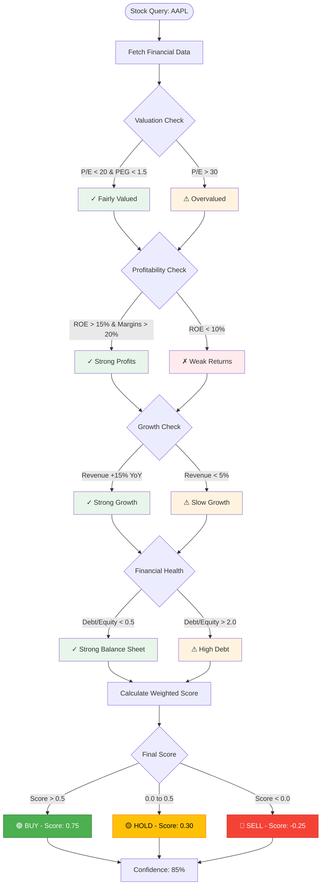

# **BD_Finance – AI-Powered Investment Decision Assistant (PRD)**
**Author:** Bruno Dias (BD)
**Version:** 4.0 (Android-Exclusive)
**Last Updated:** October 2025
**Scope:** Product requirements for BD_Finance Android app — an intelligent investment advisor that provides actionable buy/hold/sell recommendations with LLM-powered justifications and fundamental analysis flowcharts.

---

## **1. Product Vision**
Deliver a **pocket investment advisor** that transforms complex financial data into clear, actionable investment decisions. BD_Finance is a **standalone Android application** that analyzes any stock ticker and provides instant buy/hold/sell recommendations backed by AI-generated reasoning and visual fundamental analysis flowcharts.

### **Core Value Proposition**
- **Instant investment decisions:** Ask about any stock and get a clear recommendation in seconds.
- **AI-powered justification:** LLM analyzes metrics and explains the "why" behind every recommendation.
- **Visual decision flow:** Interactive flowcharts show exactly how fundamental analysis drives the verdict.
- **All-in-one mobile solution:** No backend server required — all intelligence runs on-device or via direct API calls.
- **Investor-centric metrics:** See only what matters for making investment decisions.

---

## **2. Target Users & Primary Use Case**

### **Primary User: The Decision-Making Investor**
An individual investor who needs **quick, reliable guidance** before making buy/sell decisions. They want to know:
- Should I buy this stock right now?
- What are the key metrics telling me?
- Is this a good value investment or overpriced?
- What are the risks I should know about?

### **User Personas**

| Persona | Description | Key Needs |
|----------|--------------|-----------|
| **Active Trader** | Makes frequent buy/sell decisions; monitors multiple positions. | Fast analysis, real-time data, clear signals, risk alerts. |
| **Value Investor** | Seeks undervalued companies for long-term holds. | Fundamental metrics, intrinsic valuation, margin of safety. |
| **Growth Seeker** | Focuses on companies with high growth potential. | Revenue/earnings growth, market trends, momentum indicators. |
| **Beginner Investor** | Learning to invest; needs education and guidance. | Simple explanations, educational content, confidence building. |
| **Portfolio Manager** | Manages personal portfolio; tracks performance. | Portfolio-level insights, diversification analysis, rebalancing alerts. |

---

## **3. Product Goals**
1. **Deliver actionable recommendations:** Clear BUY/HOLD/SELL verdict with confidence score for every stock query.
2. **Explain the reasoning:** LLM-generated justifications that explain why a stock is recommended or not.
3. **Visualize the decision process:** Interactive flowcharts showing how fundamental metrics drive the verdict.
4. **Respond instantly:** <3s analysis time for any ticker through intelligent caching and on-device processing.
5. **Educate investors:** Help users understand financial metrics and investment principles through contextual explanations.
6. **Track performance:** Monitor portfolio holdings and provide alerts when recommendations change.

---

## **4. System Architecture (Android-Only)**

### **Architecture Overview**
BD_Finance is a **fully self-contained Android application** with no backend server dependency. All analysis, caching, and AI processing happens either on-device or through direct API calls to third-party services.

```
┌─────────────────────────────────────────────────────────────┐
│                    Android Application                       │
├─────────────────────────────────────────────────────────────┤
│  Presentation Layer (Jetpack Compose + Material 3)          │
│    ├─ Stock Search & Query Interface                        │
│    ├─ Recommendation Display Screen                         │
│    ├─ Interactive Flowchart Viewer                          │
│    └─ Portfolio Management Dashboard                        │
├─────────────────────────────────────────────────────────────┤
│  Business Logic Layer (Kotlin)                              │
│    ├─ Stock Analysis Engine                                 │
│    ├─ Fundamental Scoring System                            │
│    ├─ Decision Tree Evaluator                               │
│    ├─ LLM Integration Service (Groq/Gemini)                 │
│    └─ Flowchart Generator                                   │
├─────────────────────────────────────────────────────────────┤
│  Data Layer (Room + Retrofit)                               │
│    ├─ Local Cache (Room SQLite)                             │
│    ├─ API Clients (Yahoo Finance, FMP, Alpha Vantage)       │
│    └─ Repository Pattern with Cache-First Strategy          │
└─────────────────────────────────────────────────────────────┘
```

### **Key Components**

#### **1. Stock Analysis Engine**
- Fetches real-time and historical financial data
- Computes fundamental metrics (P/E, P/B, ROE, ROA, debt ratios, growth rates)
- Applies scoring algorithm to generate buy/hold/sell verdict
- Calculates confidence score based on data quality and metric consistency

#### **2. LLM Justification Service**
- Sends computed metrics and verdict to LLM (Groq LLaMA 3 primary, Gemini fallback)
- Generates natural language explanation of recommendation
- Highlights key strengths, weaknesses, and risk factors
- Provides comparative context (industry averages, historical trends)

#### **3. Flowchart Decision Visualizer**
- Converts fundamental analysis logic into interactive flowchart
- Shows decision path: Entry → Metric Checks → Risk Assessment → Final Verdict
- Highlights which metrics passed/failed and their impact on recommendation
- Allows users to tap nodes for detailed metric explanations

#### **4. Local Cache System**
- Stores financial data for 24 hours (fundamentals) and 10 minutes (real-time prices)
- Reduces API calls and improves response time
- Background sync via WorkManager for watchlist stocks

#### **5. Portfolio Tracker**
- Tracks user holdings with purchase price and quantity
- Shows current value, gain/loss, and recommendation status
- Alerts when recommendation changes (e.g., BUY → HOLD)
- Computes portfolio-level metrics: total return, diversification score, risk exposure

---

## **5. Core User Journey: Stock Analysis & Recommendation**

### **5.1 Stock Query Input**
**User Action:** User enters stock ticker (e.g., "AAPL") or company name (e.g., "Apple")

**System Behavior:**
1. Validates and normalizes input (converts to uppercase, resolves company name to ticker)
2. Shows loading indicator with estimated time
3. Checks local cache for recent analysis (< 10 min for price, < 24h for fundamentals)
4. If cache miss, fetches data from APIs in parallel:
   - Yahoo Finance: Real-time price, historical prices, basic financials
   - Financial Modeling Prep: Detailed fundamentals, ratios, financial statements
   - Alpha Vantage: Backup for any missing data

**Features:**
- Auto-complete suggestions as user types
- Recent search history
- Voice input support ("Analyze Apple stock")
- Scan barcode/QR code for ticker lookup

---

### **5.2 Fundamental Analysis & Scoring**

**The system evaluates stocks using a multi-factor scoring model:**

#### **A. Valuation Metrics (Weight: 30%)**
- **P/E Ratio:** Compare to industry average and historical P/E
- **P/B Ratio:** Identify undervalued vs growth stocks
- **PEG Ratio:** Price to earnings growth (< 1 is favorable)
- **Price to Sales:** Revenue valuation multiple
- **Intrinsic Value:** DCF calculation vs current price (margin of safety)

#### **B. Profitability Metrics (Weight: 25%)**
- **ROE (Return on Equity):** > 15% is strong
- **ROA (Return on Assets):** Asset efficiency
- **Profit Margins:** Gross, operating, net margins and trends
- **ROIC:** Return on invested capital

#### **C. Growth Metrics (Weight: 20%)**
- **Revenue Growth:** YoY and 5-year CAGR
- **Earnings Growth:** EPS growth trend
- **Book Value Growth:** Equity growth over time
- **Forward Estimates:** Analyst consensus and growth projections

#### **D. Financial Health (Weight: 15%)**
- **Debt-to-Equity Ratio:** < 1.0 is conservative, sector-dependent
- **Current Ratio:** > 1.5 indicates good liquidity
- **Quick Ratio:** Ability to pay short-term obligations
- **Interest Coverage:** EBIT / Interest expense (> 3 is healthy)
- **Free Cash Flow:** Positive and growing FCF

#### **E. Dividend & Shareholder Returns (Weight: 10%)**
- **Dividend Yield:** Current yield vs historical
- **Payout Ratio:** Sustainability (< 60% is safe)
- **Dividend Growth Rate:** Consistency and growth
- **Share Buybacks:** Net buyback activity

**Scoring Logic:**
- Each metric gets a score: -1 (negative), 0 (neutral), +1 (positive)
- Weighted aggregate score determines verdict:
  - **Score > 0.5:** **BUY** recommendation
  - **Score 0.0 to 0.5:** **HOLD** recommendation
  - **Score < 0.0:** **SELL** recommendation
- Confidence level (0-100%) based on:
  - Data completeness (missing metrics reduce confidence)
  - Metric consistency (conflicting signals lower confidence)
  - Data freshness (stale data reduces confidence)

---

### **5.3 LLM-Powered Recommendation Justification**

**After scoring completes, the system generates AI-powered analysis:**

**Input to LLM:**
```
Stock: [Ticker] - [Company Name]
Sector: [Industry Sector]
Current Price: $[Price]
Recommendation: [BUY/HOLD/SELL]
Confidence: [XX%]

Key Metrics:
- P/E Ratio: [Value] ([Above/Below] industry avg of [Value])
- ROE: [Value]% ([Strong/Weak])
- Revenue Growth: [Value]% YoY
- Debt/Equity: [Value] ([Conservative/Moderate/High])
- Dividend Yield: [Value]%
[... all computed metrics ...]

Scoring Breakdown:
- Valuation Score: [X/10]
- Profitability Score: [X/10]
- Growth Score: [X/10]
- Financial Health Score: [X/10]
- Shareholder Returns Score: [X/10]

Generate a concise investment recommendation (200-300 words):
1. Opening statement with clear recommendation
2. Key strengths (2-3 bullet points)
3. Key concerns/risks (2-3 bullet points)
4. Bottom line for investor decision
```

**LLM Output Format:**
```markdown
## Investment Recommendation: [BUY/HOLD/SELL]

[Opening paragraph explaining the overall assessment]

### Strengths
- [Strength 1 with specific metrics]
- [Strength 2 with specific metrics]
- [Strength 3 with specific metrics]

### Concerns & Risks
- [Risk 1 with specific metrics]
- [Risk 2 with specific metrics]
- [Risk 3 with specific metrics]

### Bottom Line
[Final recommendation with specific action for investor]
```

**Provider Fallback:**
1. Primary: Groq LLaMA 3 (fast, cost-effective)
2. Fallback: Gemini 1.5 Pro (if Groq unavailable or timeout)
3. Cached: Use last successful analysis if both fail (with timestamp warning)

---

### **5.4 Interactive Decision Flowchart**

**Visual representation of the fundamental analysis decision tree:**



**Interactive Features:**
- Tap any node to see detailed metric values and thresholds
- Color-coded paths: Green (positive), Yellow (neutral), Red (negative)
- Animated flow showing the decision path in sequence
- Zoom and pan for detailed exploration
- Export flowchart as image for sharing

---

### **5.5 Recommendation Display Screen**

**The final recommendation screen shows:**

1. **Top Card: Verdict Summary**
   - Large badge: BUY / HOLD / SELL with color coding
   - Confidence score with progress indicator
   - Current price and day change
   - Company name, sector, market cap

2. **AI Justification Section**
   - Expandable card with LLM-generated analysis
   - Formatted markdown with bullet points
   - Highlighted key metrics within text
   - Source attribution (powered by LLaMA/Gemini)

3. **Key Metrics Grid**
   - Visual cards showing critical metrics:
     - P/E Ratio (with industry comparison)
     - ROE % (with rating: Strong/Good/Weak)
     - Revenue Growth % YoY
     - Debt/Equity (with health indicator)
     - Dividend Yield (if applicable)
   - Each metric shows pass/fail status and contribution to score

4. **Decision Flowchart**
   - Embedded interactive flowchart
   - Tap to expand fullscreen
   - Shows which criteria passed/failed

5. **Action Buttons**
   - Add to Watchlist
   - Add to Portfolio (with purchase details)
   - Share Recommendation (text/image export)
   - View Full Analysis (detailed breakdown)
   - Set Price Alert

6. **Disclaimer**
   - "This recommendation is for informational purposes only..."
   - Last updated timestamp
   - Data sources attribution

---

### **5.6 Additional Features**

#### **A. Watchlist Management**
- Save multiple stocks for monitoring
- Background refresh (daily via WorkManager)
- Push notifications when recommendation changes
- Bulk analysis: Compare up to 10 stocks side-by-side

#### **B. Portfolio Tracking**
- Add holdings with purchase price, quantity, date
- Show current recommendation vs purchase recommendation
- Calculate realized/unrealized gains
- Portfolio-level metrics:
  - Total return %
  - Best/worst performers
  - Sector allocation pie chart
  - Risk score (based on individual stock scores)
  - Suggested actions (which holdings to review)

#### **C. Stock Comparison**
- Compare 2-4 stocks side-by-side
- Metric-by-metric comparison table
- Visual radar charts showing strength profiles
- Head-to-head recommendation explanation

#### **D. Price Alerts**
- Set target price for BUY consideration
- Alert when stock hits intrinsic value target
- Notification when recommendation changes
- Earnings date reminders

#### **E. Historical Recommendation Tracking**
- Log all past analyses with timestamps
- Show recommendation accuracy over time
- "If you bought when we said BUY..." performance tracker
- Learn from past recommendations

#### **F. Educational Tooltips**
- Tap any metric to see definition
- "What is ROE?" explanations with examples
- "Why does P/E matter?" investment primers
- Interactive glossary

#### **G. Search & Discovery**
- Search by ticker, company name, or ISIN
- Browse by sector/industry
- "Top BUY recommendations" list
- "Most undervalued stocks" screener results
- "High growth stocks" filtered list

#### **H. Data Export & Sharing**
- Export analysis as PDF report
- Share recommendation via social media (formatted image)
- Export portfolio to CSV
- Email full analysis to yourself  

---

## **6. Non-Functional Requirements**

| Category | Requirement | Implementation |
|-----------|-------------|----------------|
| **Performance** | <3s response time for cached queries; <8s for fresh analysis | Aggressive caching, parallel API calls, background preloading for watchlist |
| **Reliability** | 95% successful analysis rate with graceful degradation | Multi-provider fallback (Yahoo → FMP → Alpha Vantage), cached fallback data |
| **Offline Capability** | View cached recommendations without internet | Room database stores last 30 days of analyses |
| **Security** | Secure API key storage; no PII collection | Encrypted SharedPreferences, keys in BuildConfig (obfuscated), no user data sent to servers |
| **Battery Efficiency** | Background sync should use <2% battery per day | WorkManager with exponential backoff, sync only on WiFi + charging (configurable) |
| **App Size** | <50MB download size | Modular architecture, on-demand asset loading, WebP images |
| **Accessibility** | WCAG AA compliance for vision/motor impairments | TalkBack support, dynamic text sizing, high contrast mode, voice commands |
| **Localization** | English (primary), Portuguese at launch | String resources for i18n, locale-aware number/currency formatting |
| **Data Usage** | <5MB per day for typical usage (10 stock queries) | Compressed API responses, efficient caching, background sync on WiFi only |

---

## **7. Success Metrics & KPIs**

### **Product Quality Metrics**
- **Analysis Completeness:** 95%+ of queries return complete recommendation (verdict + AI justification + flowchart)
- **Response Time:** 90% of queries complete within 3 seconds (cached) or 8 seconds (fresh)
- **Accuracy:** Track recommendation performance - measure returns if user followed BUY recommendations
- **AI Quality:** 85%+ user satisfaction with AI justifications (measured via in-app feedback)

### **User Engagement Metrics**
- **DAU/MAU Ratio:** Target 40% (users checking stocks regularly)
- **Queries per Session:** Average 3-5 stock analyses per session
- **Watchlist Adoption:** 60%+ of users create a watchlist within first week
- **Portfolio Tracking:** 40%+ of users add at least one holding
- **Return Rate:** 70% of users return within 7 days

### **Technical Health Metrics**
- **Crash-Free Rate:** 99.5%+ (Firebase Crashlytics)
- **API Success Rate:** 95%+ successful data fetches
- **Cache Hit Rate:** 60%+ queries served from cache
- **App Rating:** 4.3+ on Google Play Store
- **Retention:** 50% Day-7 retention, 30% Day-30 retention

### **Business/Growth Metrics**
- **Acquisition:** 10,000+ installs in first 3 months
- **Organic Growth:** 40%+ of installs from search/word-of-mouth
- **User Feedback:** <5% negative reviews, >20% users leave positive review
- **Feature Adoption:** 70%+ users try AI justification, 50%+ view flowchart  

---

## **8. Risks & Mitigation Strategies**

| Risk Category | Specific Risk | Impact | Likelihood | Mitigation Strategy |
|---------------|---------------|--------|------------|---------------------|
| **Data Quality** | Missing/incomplete financial data | High | Medium | Multi-source fallback; show data quality indicator; reduce confidence score |
| **Data Quality** | Stale data leads to wrong recommendation | High | Low | TTL-based cache expiration; visual "last updated" timestamp; force refresh option |
| **API Reliability** | Rate limits from data providers | Medium | High | Aggressive caching (24h for fundamentals); rotate between providers; request throttling |
| **API Reliability** | Provider downtime | Medium | Medium | 3-tier fallback (Yahoo → FMP → Alpha Vantage); cached data as last resort |
| **AI/LLM** | LLM timeout or unavailability | Medium | Medium | 2-provider fallback (Groq → Gemini); cached justification with timestamp warning |
| **AI/LLM** | AI generates incorrect/misleading analysis | High | Low | Ground all AI outputs in actual metrics; human-review prompt templates; disclaimers |
| **AI/LLM** | LLM costs spiral out of control | Medium | Low | Use cost-effective Groq as primary; implement request caching; rate limit per user |
| **Performance** | Slow analysis time frustrates users | Medium | Medium | Pre-fetch watchlist stocks; parallel API calls; show progress indicators |
| **Legal** | Users make bad decisions and blame app | Critical | Medium | Strong disclaimers; "not financial advice" warnings; educational content emphasis |
| **Legal** | Data licensing issues | High | Low | Use only publicly available free-tier APIs; attribute sources; review ToS compliance |
| **User Experience** | UI too complex for beginners | Medium | High | Progressive disclosure; beginner mode vs advanced mode; onboarding tutorial |
| **User Experience** | Users don't trust AI recommendations | High | Medium | Show calculation transparency; provide flowchart; allow metric adjustment; track record |
| **Market Conditions** | Volatile markets make recommendations obsolete quickly | Medium | Medium | Frequent updates for watchlist; volatility warnings; shorter cache TTL in high VIX |
| **Competition** | Users prefer existing apps (Yahoo Finance, etc) | High | High | Differentiate on AI justification + flowchart; better UX; offline capability |

---

## **9. Future Enhancements (Post-MVP)**

### **Phase 2: Enhanced Analytics**
- **Technical Analysis Integration:** Add MACD, RSI, moving averages to complement fundamental analysis
- **Earnings Prediction:** Predict earnings surprises based on historical patterns
- **Insider Trading Tracking:** Show recent insider buy/sell activity
- **Short Interest Analysis:** Track short interest changes and squeeze potential
- **Options Flow:** Unusual options activity as sentiment indicator

### **Phase 3: Social & Community**
- **Social Sentiment Analysis:** Aggregate sentiment from Reddit, Twitter, StockTwits, SeekingAlpha
- **Crowd Wisdom:** Show what % of BD_Finance users have each stock as BUY/HOLD/SELL
- **User Comments:** Allow users to share thoughts on stocks (moderated)
- **Expert Opinions:** Curate analyst ratings and price targets from major firms

### **Phase 4: Advanced Portfolio Management**
- **Auto-Rebalancing Suggestions:** Recommend which stocks to buy/sell to maintain target allocation
- **Tax Loss Harvesting:** Identify opportunities to sell losers for tax benefits
- **Dividend Optimizer:** Suggest dividend stocks to hit income targets
- **Risk Parity:** Balance portfolio based on volatility-adjusted risk

### **Phase 5: Broker Integration & Automation**
- **Paper Trading:** Virtual portfolio to test strategies without real money
- **Broker API Integration:** Connect to Robinhood, E*TRADE, Interactive Brokers for live sync
- **One-Tap Trading:** Execute trades directly from app (with confirmations)
- **Dollar-Cost Averaging Automation:** Auto-invest on schedule

### **Phase 6: AI & Personalization**
- **Voice Assistant:** "Hey BD, should I buy Tesla?" voice commands
- **Personalized Learning:** AI learns user risk tolerance and investment style
- **Custom Scoring Models:** Users can adjust metric weights based on their strategy
- **AI Portfolio Assistant:** Conversational interface for portfolio questions

### **Phase 7: Macro & Market Context**
- **Macro Dashboard:** GDP, CPI, unemployment, Fed rates with impact analysis
- **Sector Rotation:** Identify which sectors are outperforming based on economic cycle
- **Market Regime Detection:** Bull/bear/sideways market identification
- **Global Markets:** Expand beyond US to international stocks

### **Phase 8: Premium Features**
- **Real-Time Data:** Sub-second price updates (premium tier)
- **Advanced Screeners:** Complex multi-factor stock screening
- **Backtesting:** Test strategies against historical data
- **API Access:** Developers can access BD_Finance analysis via API
- **White-Label:** Allow financial advisors to use BD_Finance with their branding  

---

## **10. Technical Stack (Android-Only)**

| Layer | Technology | Purpose |
|-------|-------------|---------|
| **Language** | Kotlin 1.9+ | Primary development language |
| **UI Framework** | Jetpack Compose + Material 3 | Modern declarative UI |
| **Architecture** | MVVM + Clean Architecture | Separation of concerns, testability |
| **Dependency Injection** | Hilt (Dagger) | Dependency management |
| **Networking** | Retrofit 2 + OkHttp | REST API calls with interceptors |
| **Local Database** | Room (SQLite) | Persistent caching and storage |
| **Async Operations** | Kotlin Coroutines + Flow | Non-blocking operations, reactive streams |
| **Background Work** | WorkManager | Scheduled tasks, background sync |
| **AI/LLM** | Groq API (LLaMA 3.1), Gemini API fallback | Natural language analysis generation |
| **Charts & Visualization** | MPAndroidChart + Compose Canvas | Stock charts and metric visualizations |
| **Flowchart Rendering** | WebView + Mermaid.js OR custom Compose drawing | Interactive decision flowcharts |
| **Image Loading** | Coil | Efficient image loading (company logos) |
| **Analytics** | Firebase Analytics + Crashlytics | Usage tracking and crash reporting |
| **Notifications** | Firebase Cloud Messaging (FCM) | Push alerts for price/recommendation changes |
| **Security** | Android Keystore + encrypted SharedPreferences | Secure API key storage |
| **Testing** | JUnit 5, Mockk, Compose UI Testing | Unit, integration, and UI tests |
| **Build System** | Gradle (Kotlin DSL) | Build automation |
| **Code Quality** | Detekt, ktlint | Static analysis and formatting |
| **Version Control** | Git + GitHub | Source control |
| **CI/CD** | GitHub Actions | Automated testing and deployment |

### **Key Libraries**
```kotlin
dependencies {
    // Core Android
    implementation("androidx.core:core-ktx:1.12.0")
    implementation("androidx.lifecycle:lifecycle-runtime-ktx:2.7.0")

    // Jetpack Compose
    implementation("androidx.compose.ui:ui:1.6.0")
    implementation("androidx.compose.material3:material3:1.2.0")
    implementation("androidx.navigation:navigation-compose:2.7.6")

    // Dependency Injection
    implementation("com.google.dagger:hilt-android:2.50")

    // Networking
    implementation("com.squareup.retrofit2:retrofit:2.9.0")
    implementation("com.squareup.okhttp3:okhttp:4.12.0")

    // Database
    implementation("androidx.room:room-runtime:2.6.1")
    implementation("androidx.room:room-ktx:2.6.1")

    // Background Work
    implementation("androidx.work:work-runtime-ktx:2.9.0")

    // Charts
    implementation("com.github.PhilJay:MPAndroidChart:v3.1.0")

    // Firebase
    implementation("com.google.firebase:firebase-analytics-ktx:21.5.0")
    implementation("com.google.firebase:firebase-crashlytics-ktx:18.6.0")
}
```

### **Data Providers & APIs**
| Provider | Purpose | Tier |
|----------|---------|------|
| **Yahoo Finance (unofficial)** | Real-time prices, historical data, basic fundamentals | Free |
| **Financial Modeling Prep** | Detailed fundamentals, financial statements, ratios | Free tier (250 calls/day) |
| **Alpha Vantage** | Backup for fundamentals and technicals | Free tier (25 calls/day) |
| **Groq** | LLM inference (LLaMA 3.1) | Free tier (limited TPM) |
| **Google Gemini** | LLM fallback | Free tier (60 req/min) |

### **No Backend Server Required**
This is a **fully client-side Android application**. All business logic, scoring, and analysis happen on-device. The app only makes direct API calls to:
- Financial data providers (Yahoo, FMP, Alpha Vantage)
- LLM providers (Groq, Gemini)
- Firebase services (analytics, crash reporting)

**Benefits:**
- No server hosting costs
- No backend maintenance
- Better privacy (no user data collection)
- Works offline with cached data
- Faster development and deployment

---

## **11. Example User Flow**

**Scenario:** Sarah wants to know if she should invest in Microsoft (MSFT)

1. **Search**
   - Sarah opens BD_Finance app
   - Types "Microsoft" in search bar
   - Selects "MSFT - Microsoft Corporation" from autocomplete

2. **Analysis (3-8 seconds)**
   - Loading screen shows: "Fetching financial data..."
   - Progress bar: "Analyzing fundamentals..." → "Generating AI insights..." → "Creating flowchart..."

3. **Results Screen**
   ```
   ╔═══════════════════════════════════════════╗
   ║  🟢 STRONG BUY                            ║
   ║  Confidence: 82%                          ║
   ║                                           ║
   ║  MSFT - Microsoft Corporation             ║
   ║  $425.30 (+2.4%)                          ║
   ║  Technology | $3.2T Market Cap            ║
   ╚═══════════════════════════════════════════╝

   📊 AI Investment Analysis
   ─────────────────────────────────────────────
   Microsoft represents a compelling buy opportunity
   with strong fundamentals across all key metrics.
   The company trades at a reasonable 35x P/E ratio
   given its 15% revenue growth and market-leading
   position in cloud computing.

   ✅ Strengths
   • Exceptional profitability (ROE: 43%, margins: 35%)
   • Strong revenue growth (15% YoY, accelerating)
   • Rock-solid balance sheet (Debt/Equity: 0.3)

   ⚠️ Concerns & Risks
   • Valuation slightly above 10-year average
   • Slowing PC market impacts Windows revenue
   • Regulatory scrutiny on AI partnerships

   💡 Bottom Line
   Microsoft's Azure growth and AI leadership justify
   current valuation. Suitable for growth and quality
   investors with 3+ year horizon.

   Powered by Groq LLaMA 3.1 | Last updated: 2 min ago

   ┌─────────────────────────────────────────┐
   │  📈 Key Metrics                         │
   ├─────────────────────────────────────────┤
   │  P/E Ratio: 35.2  [✓ vs Industry: 42.1]│
   │  ROE: 43.1%       [✓ Strong]            │
   │  Revenue Growth: +15.2% YoY [✓ Strong]  │
   │  Debt/Equity: 0.31 [✓ Conservative]     │
   │  Dividend Yield: 0.8% [○ Low]           │
   └─────────────────────────────────────────┘

   🔀 Decision Flowchart [Tap to expand]
   [Interactive flowchart preview shown]

   ┌─────────────────────────────────────────┐
   │  [+ Add to Watchlist]  [+ Add to Port.] │
   │  [🔔 Set Alert]  [Share] [Full Analysis]│
   └─────────────────────────────────────────┘
   ```

4. **User Actions**
   - Sarah taps flowchart to see detailed decision path
   - Reviews which metrics passed/failed
   - Adds MSFT to her watchlist
   - Sets a price alert at $400

5. **Follow-Up**
   - Sarah compares MSFT with GOOGL side-by-side
   - Adds both to her portfolio tracker
   - Receives daily notifications if recommendation changes

---

## **12. User Interface Mockup Structure**

### **Main Navigation**
```
┌─────────────────────────────────────────────┐
│ [🔍 Search]  Watchlist  Portfolio  More     │
└─────────────────────────────────────────────┘
```

### **Key Screens**

1. **Home/Search Screen**
   - Large search bar: "Search stocks by name or ticker..."
   - Voice search button
   - Recent searches (chips)
   - Quick actions: "Top BUY Picks Today" | "My Watchlist" | "Portfolio"

2. **Stock Analysis Screen** (detailed above)
   - Verdict card (BUY/HOLD/SELL with confidence)
   - AI justification (expandable)
   - Key metrics grid
   - Interactive flowchart
   - Action buttons

3. **Watchlist Screen**
   - List of saved stocks
   - Each row shows: Ticker | Price | Change% | Recommendation badge
   - Pull to refresh
   - Tap row → full analysis
   - Long press → remove or set alert

4. **Portfolio Screen**
   - Total value and gain/loss summary
   - Holdings list with entry price vs current
   - Recommendation status for each holding
   - Sector allocation pie chart
   - "Suggested Actions" card

5. **Stock Comparison Screen**
   - Side-by-side metric comparison table
   - Radar chart showing strength profiles
   - Recommendation comparison
   - "Winner" indicator

6. **Settings Screen**
   - Notification preferences
   - Cache settings (refresh frequency)
   - Theme (dark/light/auto)
   - API provider preferences
   - About & disclaimers

---

## **13. Disclaimer & Legal**

### **Investment Disclaimer**
```
⚠️ IMPORTANT DISCLAIMER

BD_Finance provides stock analysis and recommendations
for educational and informational purposes only.

This is NOT financial advice. We are not registered
investment advisors. All investment decisions are
your responsibility.

Past performance does not guarantee future results.
Stock markets are volatile and you can lose money.

Always conduct your own research and consult with
a qualified financial advisor before making investment
decisions.

By using this app, you acknowledge that:
• You understand the risks of investing
• You will not rely solely on this app for decisions
• BD_Finance is not liable for investment losses
• Data may contain errors or be outdated
```

### **Data Attribution**
- Market data: Yahoo Finance, Financial Modeling Prep, Alpha Vantage
- AI analysis: Groq (LLaMA 3.1), Google Gemini
- All data is provided "as-is" without warranty

### **Privacy Policy**
- No personal financial data is collected
- No user portfolio data is sent to servers
- Anonymous usage analytics via Firebase (opt-out available)
- API keys stored securely on-device

---

## **14. TL;DR (Resumo em Português)**

O **BD_Finance** é uma **aplicação Android autónoma** que funciona como um consultor financeiro pessoal. O utilizador pergunta sobre qualquer ação (ticker ou nome) e recebe:

1. **Recomendação clara:** COMPRAR, MANTER ou VENDER com nível de confiança
2. **Justificação AI:** Análise em linguagem natural gerada por LLM explicando o "porquê"
3. **Fluxograma interativo:** Visualização das métricas fundamentais que levaram à decisão
4. **Métricas essenciais:** P/E, ROE, crescimento, dívida, dividendos com status de aprovação/reprovação

**Arquitetura:** 100% Android (sem servidor backend). Todos os dados vêm diretamente de APIs públicas (Yahoo Finance, Financial Modeling Prep). A análise AI usa Groq (LLaMA 3.1) ou Gemini como fallback.

**Funcionalidades principais:**
- Análise instantânea de ações (< 3s com cache, < 8s sem cache)
- Lista de observação com alertas de mudança de recomendação
- Rastreamento de portfólio com ganhos/perdas
- Comparação lado a lado de múltiplas ações
- Funciona offline com dados em cache (últimos 30 dias)
- Explicações educativas de todas as métricas

**Diferencial:** Combina scoring quantitativo robusto com justificativa AI natural e visualização transparente do processo de decisão através de fluxogramas interativos. Ideal para investidores que querem decisões rápidas mas fundamentadas.

---

## **15. Appendix: Fundamental Scoring Algorithm Details**

### **Detailed Metric Thresholds**

#### **Valuation Metrics (30% weight)**
```
P/E Ratio Score:
  +1: P/E < industry average AND P/E < 20
   0: P/E between 20-30 OR near industry average
  -1: P/E > 30 AND P/E > industry average

P/B Ratio Score:
  +1: P/B < 3 (value stock indicator)
   0: P/B 3-5
  -1: P/B > 5 (potential overvaluation)

PEG Ratio Score:
  +1: PEG < 1 (undervalued growth)
   0: PEG 1-2
  -1: PEG > 2 (expensive growth)

Intrinsic Value (DCF) Score:
  +1: Current price < 80% of intrinsic value (margin of safety)
   0: Price 80%-100% of intrinsic value
  -1: Price > 100% of intrinsic value (overvalued)
```

#### **Profitability Metrics (25% weight)**
```
ROE Score:
  +1: ROE > 15%
   0: ROE 10%-15%
  -1: ROE < 10%

Profit Margin Score:
  +1: Net margin > 15% AND increasing YoY
   0: Net margin 5-15%
  -1: Net margin < 5% OR declining YoY

ROIC Score:
  +1: ROIC > 12%
   0: ROIC 8-12%
  -1: ROIC < 8%
```

#### **Growth Metrics (20% weight)**
```
Revenue Growth Score:
  +1: YoY growth > 15%
   0: YoY growth 5-15%
  -1: YoY growth < 5% OR negative

Earnings Growth Score:
  +1: EPS CAGR (5yr) > 15%
   0: EPS CAGR 5-15%
  -1: EPS CAGR < 5%
```

#### **Financial Health (15% weight)**
```
Debt/Equity Score:
  +1: D/E < 0.5 (very conservative)
   0: D/E 0.5-1.5 (sector-adjusted)
  -1: D/E > 1.5 (high leverage)

Current Ratio Score:
  +1: Current ratio > 2.0
   0: Current ratio 1.0-2.0
  -1: Current ratio < 1.0

Free Cash Flow Score:
  +1: FCF positive AND growing
   0: FCF positive but flat
  -1: FCF negative
```

#### **Shareholder Returns (10% weight)**
```
Dividend Score:
  +1: Yield > 2% AND payout ratio < 60%
   0: Yield 1-2% OR non-dividend payer with buybacks
  -1: No yield AND no buybacks OR payout ratio > 80%
```

### **Final Score Calculation**
```kotlin
fun calculateFinalScore(metrics: StockMetrics): Double {
    val valuationScore = (
        metrics.peScore * 0.08 +
        metrics.pbScore * 0.07 +
        metrics.pegScore * 0.08 +
        metrics.dcfScore * 0.07
    )

    val profitabilityScore = (
        metrics.roeScore * 0.10 +
        metrics.marginScore * 0.08 +
        metrics.roicScore * 0.07
    )

    val growthScore = (
        metrics.revenueGrowthScore * 0.12 +
        metrics.epsGrowthScore * 0.08
    )

    val healthScore = (
        metrics.debtScore * 0.06 +
        metrics.currentRatioScore * 0.05 +
        metrics.fcfScore * 0.04
    )

    val dividendScore = metrics.dividendScore * 0.10

    return valuationScore + profitabilityScore +
           growthScore + healthScore + dividendScore
}

fun getRecommendation(score: Double): Recommendation {
    return when {
        score > 0.5 -> Recommendation.BUY
        score >= 0.0 -> Recommendation.HOLD
        else -> Recommendation.SELL
    }
}
```

### **Confidence Score Calculation**
```kotlin
fun calculateConfidence(
    metrics: StockMetrics,
    dataQuality: DataQuality
): Int {
    var confidence = 100

    // Reduce for missing data
    confidence -= dataQuality.missingMetrics * 5

    // Reduce for stale data
    if (dataQuality.dataAge > 7.days) confidence -= 10

    // Reduce for conflicting signals
    if (hasConflictingSignals(metrics)) confidence -= 15

    // Reduce for low liquidity stocks
    if (metrics.avgVolume < 100_000) confidence -= 10

    return confidence.coerceIn(0, 100)
}
```

---

**END OF PRD**
